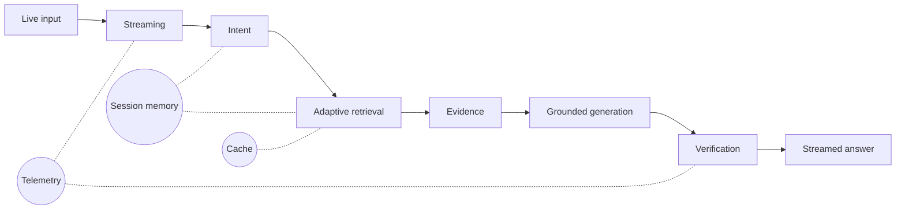

# StreamRAG: Streaming Live RAG

**Samsung PRISM GenAI Hackathon 2026–27, Theme 4.**

StreamRAG answers spoken, multi-part questions from trusted documents while the user is still talking. It verifies
every statement against the section it cites, and it updates only what changed when the user adds a detail or
corrects themselves.

> **Status: Phase 11, final.** The architecture is frozen (`docs/architecture/14_final_architecture.md`).
> **Official Theme 4 corpus: NOT AVAILABLE.** Every number in this repository comes from fictional fixture corpora
> with implementer-written labels: **TEST FIXTURE ONLY, NOT REPORTABLE** as official results.
> **No Samsung hardware, SDK, model or service is used.**

## Submission (Samsung PRISM GenAI Hackathon Y2026, Theme 4)

| item | where |
|---|---|
| source code | this repository (`src/streamrag/`), tag `PRISM_GENAI_HACKATHON_Y2026` |
| requirements | `requirements.txt` (pinned: `requirements.lock`) |
| presentation | `presentation/StreamRAG_Theme4_Submission.pptx` (official template, 12 slides); speaker version: `FINAL_PRESENTATION.md` (18 slides) |
| demo video | _link to be added_ |
| AI disclosure | `AI_DISCLOSURE.md` (draft of the official form) |
| results | `FINAL_BENCHMARK_RESULTS/README.md` |
| checklist | `HACKATHON_FINAL_CHECKLIST.md` |

## What it does



1. **Retrieves while the user speaks.** A rule-based controller decides, chunk by chunk, whether to retrieve, wait or
   skip.
2. **Splits the request into needs.** Each need gets claim requirements: what it must establish, such as an amount, a
   duration or a form.
3. **Adaptive retrieval per need.** Keyword fast path, filtered, semantic, hybrid, iterative or multi-hop, with a
   bounded stop rule. There is no LLM in this loop.
4. **Evidence lifecycle and delta retrieval.** A late detail or correction re-retrieves only the affected need. Stale
   or superseded evidence is dropped, and obsolete work is cancelled.
5. **Verified streaming answer.**
   * Drafts appear while the user speaks.
   * Every claim is checked against its cited section by an NLI model, and citations are rebuilt from that check.
   * Conflicting sources are reported side by side, and superseded versions are labelled.
6. **Asynchronous runtime.** Prioritised, deadline-bounded tasks with backpressure and retries. Degraded modes
   (extractive, lexical-only) are always declared.

## Quickstart

### A. Docker (one command, offline, no keys)

```bash
docker compose up --build
```

Open http://127.0.0.1:8080. This path serves verified **extractive** answers with no LLM.

To add the local LLM, run it as a compose sidecar:

```bash
docker compose --profile llm up --build
```

The first time, pull the model:

```bash
docker compose exec ollama ollama pull qwen3:4b
```

On a Mac, the host's Ollama (Metal GPU) is faster. See `docs/deployment/README.md` §2.

### B. Local (Python 3.11 or newer)

```bash
python3 -m venv .venv && .venv/bin/pip install -r requirements.lock && .venv/bin/pip install -e . --no-deps
```

```bash
.venv/bin/streamrag fetch-models bge-small-en-v1.5 nli-deberta-v3-xsmall
```

Optional, for LLM-written answers:

```bash
ollama pull qwen3:4b
```

```bash
ollama serve
```

Launch the demo:

```bash
.venv/bin/streamrag serve
```

Open http://127.0.0.1:8080.
* The header shows **Ready**, the LLM state and **Demo data**.
* Without Ollama, the server runs in verified extractive mode and says so. You can force this with `--no-llm`.

## Demo

The demo corpus (`demo/corpus/`) holds fictional Riverbank University scholarship rules. The ten scripted scenarios
(`demo/scenarios.yaml`) stream word by word, as speech would arrive:

| scenario | what it shows |
|---|---|
| A. Normal question | stages Query → Retrieval → Evidence while the question is still arriving; verified answer with citation; timing line |
| B. Multi-intent | three needs, one answer with a cited section per need |
| C1 / C2. Adaptive simple / complex | keyword fast path vs filtered search; the plan is shown per need |
| D. Late correction | "Sorry, I mean for international students": new condition, outdated search dropped, answer updated |
| D2. ASR revision | a recognised word revised mid-sentence; the answer follows the revision |
| E. Evidence | click a citation to see the exact section text |
| F1. Contradiction | two notices disagree: both reported |
| F2. Temporal | the current rule is used, and the superseded one is labelled |
| F3. Uncertainty | "The retrieved documents do not contain an answer to …" instead of a guess |

You can also type or paste your own question. The six-minute script is in `DEMO_SCRIPT.md`.

**Automated check.** This runs every scenario headlessly and checks its declared expectations. The exit code is 1 on
any failure.

```bash
.venv/bin/streamrag demo-check
```

## Evaluation

The final benchmark is described in `FINAL_BENCHMARK_RESULTS/README.md`:
* a held-out set written and hash-frozen **before** any Phase 11 change (`streamrag_eval_v2`, 81 turns, new domain);
* eleven baselines and variants, paired statistics, and a regression check against Phase 10.

Reproduce it as follows (needs `ollama serve` with `qwen3:4b`; about 30 minutes on an M5 Pro). First run the
benchmark:

```bash
.venv/bin/python experiments/runners/run_experiments.py --index-root /tmp/streamrag_idx --dataset streamrag_eval_v2 --results-dir runs/final_benchmark --experiments-file experiments/configs/final_benchmark.yaml --only HELDOUT_V2
```

Then rebuild the tables from the stored results:

```bash
.venv/bin/python experiments/runners/final_tables.py
```

**Headline results** (held-out v2; p50 latency on one laptop with a local 4B model):

| | full system | naive RAG | hybrid + rerank | same pipeline, batch |
|---|---|---|---|---|
| time to first evidence | **0.26 s** | n/a (after end) | n/a | 0.77 s |
| time to first answer content | **0.27 s** | n/a | n/a | 2.48 s |
| verified answer, after the user stops | 1.64 s | **1.41 s** | 1.49 s | 1.66 s |
| stale values asserted | **0 / 13** | 3 / 13 | 2 / 13 | 0 / 13 |
| hallucinated-value claim rate | **0.000** | 0.070 | 0.062 | 0.000 |
| evidence precision | **0.55** | 0.25 | 0.24 | 0.55 |
| answer correctness | 0.72 | 0.76 | **0.80** | 0.73 |
| Recall@5 | 0.88 | **0.99** | 0.96 | 0.94 |

Answer correctness differences are **not significant**. The full system is not more accurate than the baselines; its
gains are early evidence, no stale or hallucinated values, and precise, verified citations. Weaknesses are listed in
`LIMITATIONS.md`.

## Configuration

* **Configuration layers.** The frozen pipeline is `configs/default.yaml` + `configs/profiles/final.yaml`.
  * Environment variables (`STREAMRAG_*`, see `.env.example`) override the profile.
  * `--set key=value` overrides everything.
* **No secrets.** The system needs no API keys.
* **The only network call** goes to the LLM endpoint. It must be loopback unless allowlisted in
  `STREAMRAG_ALLOWED_LLM_HOSTS`.
* **Your own corpus.** Point `STREAMRAG_CORPUS` (or `--corpus`) at a directory of `.md`, `.txt` or `.pdf` files. The
  index is built at start-up.

| variable | default | purpose |
|---|---|---|
| `STREAMRAG_HOST` / `STREAMRAG_PORT` | `127.0.0.1` / `8080` | server bind address |
| `STREAMRAG_CORPUS` | `demo/corpus` (serve) | corpus directory |
| `STREAMRAG_LLM_BACKEND` | `auto` | `auto` (LLM if reachable), `ollama`, `extractive` |
| `STREAMRAG_LLM_URL` / `STREAMRAG_LLM_MODEL` | `http://127.0.0.1:11434` / `qwen3:4b` | local LLM |
| `STREAMRAG_ALLOWED_LLM_HOSTS` | empty | non-loopback LLM hosts allowed (comma-separated) |
| `STREAMRAG_LOG_LEVEL` | `INFO` | structured JSON logs on stderr; no transcript or answer text |

## HTTP API

| method and path | purpose |
|---|---|
| `GET /health` | liveness |
| `GET /ready` | readiness: index, models and LLM state; `degraded: true` without the LLM |
| `GET /api/info`, `GET /api/scenarios` | pipeline info and demo scenarios |
| `POST /api/sessions` | start a session |
| `POST /api/sessions/{id}/chunks` | push transcript chunks (with revisions) |
| `POST /api/sessions/{id}/end` | end the utterance |
| `POST /api/sessions/{id}/scenario` | run a demo scenario |
| `GET /api/sessions/{id}/events` | Server-Sent Events: stages, plans, evidence, changes, draft and final answers, metrics |
| `DELETE /api/sessions/{id}` | close a session |
| `GET /api/sources/{citation}` | the section text behind a citation |

## Tests

```bash
.venv/bin/python -m pytest -q
```

Tests that need the downloaded models skip automatically if `./models` is absent.

## Repository layout

```
src/streamrag/     the system (27 subpackages); server/ = HTTP API + demo UI; cli.py = `streamrag`
configs/           default.yaml, profiles/final.yaml (frozen pipeline), lexicons, models.yaml (pinned models)
demo/              demo corpus (fictional) and scenarios
experiments/       evaluation package: datasets (v1, v2 frozen), configs, runners, Phase 10 results
FINAL_BENCHMARK_RESULTS/  Phase 11 final benchmark, regression, robustness, demo check, resources
research/          research write-up (problem … conclusion) and per-phase benchmark scripts (phase1–9)
docs/              architecture, ADRs, component docs, deployment, security, evaluation, CLI reference
tests/             tests; tests/fixtures = TEST FIXTURES only
```

## Documents

| document | contents |
|---|---|
| `FINAL_SOLUTION.md` | the solution in one sentence, three sentences, 30 s, 2 min and 5 min |
| `FINAL_PROBLEM_STATEMENT.md`, `NOVELTY.md`, `LIMITATIONS.md` | problem, what is new (and what is not), weaknesses |
| `FINAL_TECHNICAL_EXPLANATION.md` | how every stage works, with module pointers |
| `FINAL_BENCHMARK_RESULTS/README.md` | final benchmark, regression, ablations, robustness, demo check |
| `FINAL_RESEARCH_CONCLUSION.md`, `research/` | research questions, findings, conclusion |
| `DEMO_SCRIPT.md`, `JUDGE_QA.md`, `FINAL_PRESENTATION.md` | demo, judge questions, 18-slide deck |
| `HACKATHON_FINAL_CHECKLIST.md`, `FINAL_PROJECT_AUDIT.md` | submission checklist and audit |
| `docs/architecture/14_final_architecture.md` | frozen architecture and diagrams |
| `docs/deployment/`, `docs/security/`, `docs/memory/`, `docs/cli_reference.md` | deployment, security and privacy, session memory, component CLI |
| `PHASE_1_RESEARCH_DOSSIER.md` … `PHASE_10_EVALUATION_REPORT.md` | per-phase research, specification and reports |
