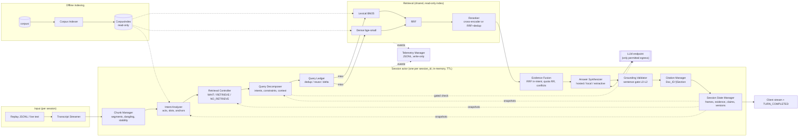

# 01: System Overview

This is a design artifact (Phase 2). The normative source is `PHASE_2_SYSTEM_SPECIFICATION.md` §18, §19 and §25.

## Component view

## Responsibilities at a glance

| Component | One-line responsibility | Spec |
|---|---|---|
| Transcript Streamer | Parse, validate and pace input events | §18.1 |
| Chunk Manager | Idempotent accumulation and segmentation | §18.2 |
| Intent Analyzer | Dialog act, slots, anchors, topic continuity | §18.4 |
| Retrieval Controller | Per-segment WAIT / RETRIEVE / NO_RETRIEVE | §8, §18.3 |
| Query Decomposer | Intents, constraints, context propagation, guards | §9, §18.5 |
| Query Ledger | No duplicate retrieval; reuse; delta | §13, §18.15 |
| Lexical / Dense / RRF / Reranker | Hybrid retrieval per intent | §10 |
| Evidence Fusion | One budgeted, labeled evidence set | §12 |
| Answer Synthesizer | Label-constrained generation; refine ops | §16.3, §14 |
| Grounding Validator | Sentence-gated verification and uncertainty | §16 |
| Citation Manager | Label → evidence → citation key; existence check | §16.7 |
| Session State Manager | Frames, ledger, evidence, claims, versions | §13, §17 |
| Telemetry Manager | Every event to JSONL; never read back | §6, §18.14 |

## Trust boundaries

- **Inside the container:** everything except the LLM endpoint.
- **Egress:** only the configured LLM endpoint, in hosted mode. Extractive and local modes run with networking disabled.
- **Shared across sessions:** only the read-only `CorpusIndex` and pure-function caches.
