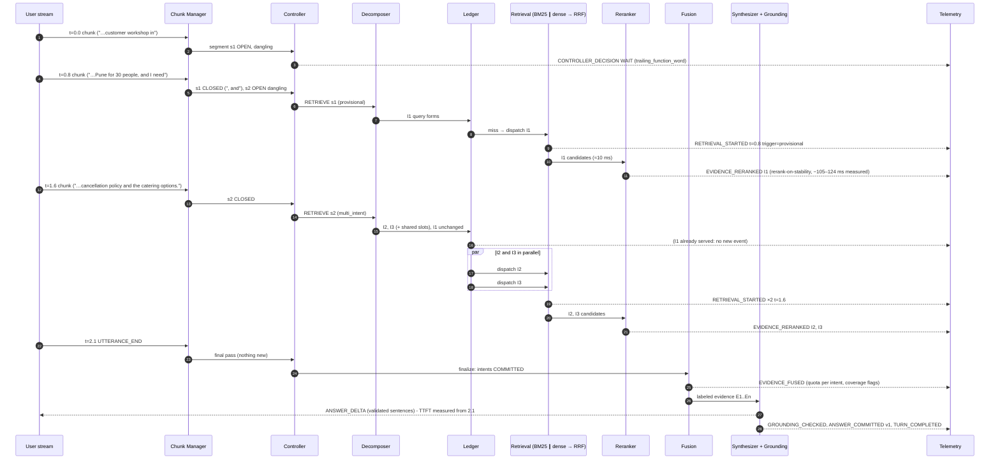

# 02: Streaming Flow

This is a design artifact (Phase 2). Normative: spec §7, §8, §19, §20.

## Guide Example 1 as a sequence (paraphrased chunks; stream time in seconds)

## What runs where in time

| Stream time | Activity | Basis |
|---|---|---|
| 0.0–1.6 s | User speaking | Input |
| 0.80–0.81 s | I1 retrieval (BM25 ∥ dense → RRF) | [M] components |
| 0.81–0.93 s | I1 rerank on stability (20 pairs) | [M] 105–124 ms |
| 1.60–1.61 s | I2, I3 retrieval in parallel | [M] components |
| 1.61–1.86 s | I2 + I3 rerank (serial) | [M] 2 × 105–124 ms |
| 1.6–2.1 s | Endpoint silence (slack ≈ +0.24 s on the dev machine) | Input |
| 2.10–2.115 s | Fusion + prompt assembly | [E] |
| 2.115 s → | LLM first validated sentence | Backend-dependent, to be measured |

Rows marked [M] use measured component latencies; their composition into this timeline is an estimate. Spill risk on slower hardware is covered in spec §20.4.

## Rules that make this work

1. Retrieval is triggered by **segment events** (closure or stability), never by chunk arrival.
2. Provisional work is **reused** through the ledger. I1 is not searched again at 1.6 s.
3. Reranking runs **when a segment closes**, so it fits in the speech gap.
4. Synthesis starts **only** at `UTTERANCE_END`. Tokens are released one validated sentence at a time.
