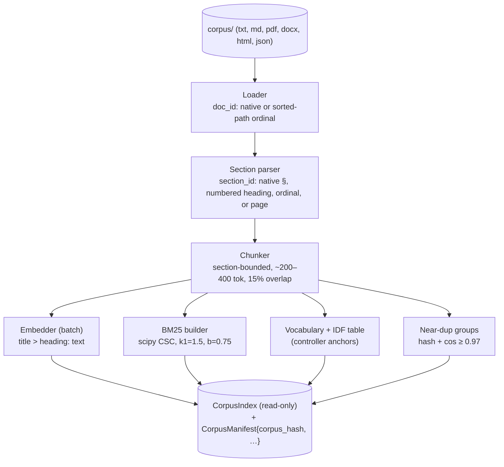
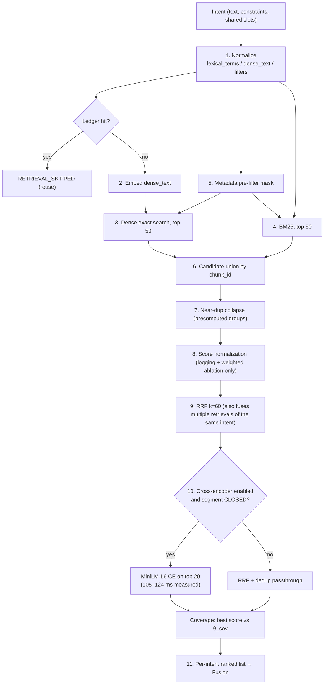
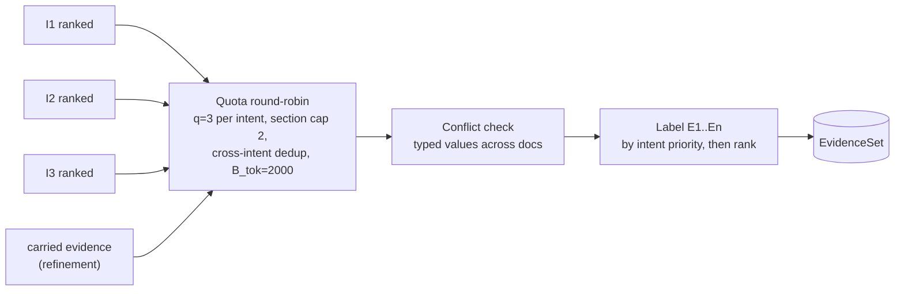

# 03: Retrieval Flow

This is a design artifact (Phase 2). Normative: spec §10, §11, §12.

## Index time

## Query time (one intent)

## Across intents (fusion)

**Why two fusion methods.** RRF combines rankings of the *same* question. Quotas share the budget across *different* questions. See ADR-009.
