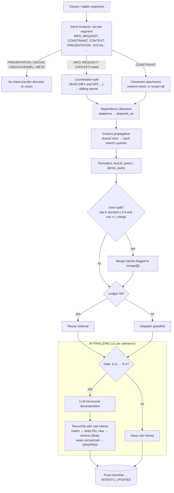
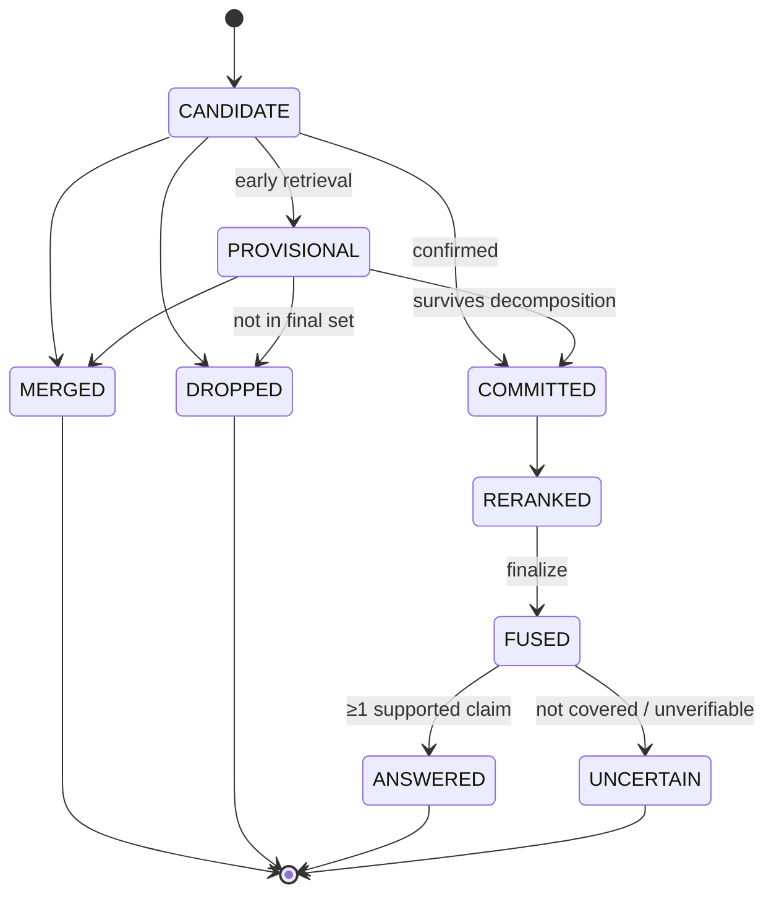

# 04: Multi-Intent Flow

This is a design artifact (Phase 2). Normative: spec §9.

## Rule path (during speech) and gated LLM check (at finalize)

## Intent lifecycle

## Abstract example

*"I need information about X, and also tell me Y, especially if Z applies."*

| Element | Value |
|---|---|
| I1 | X (CLOSED at ", and also", so provisional retrieval) |
| I2 | Y (multi_intent) |
| K1 | condition Z → scope [I2], confidence 0.6. Ambiguous scope triggers gate G-c, and the LLM check may widen it to [I1, I2]. |
| Dispatch | I1 and I2 in parallel. Z's terms are appended to I2's lexical query. |
