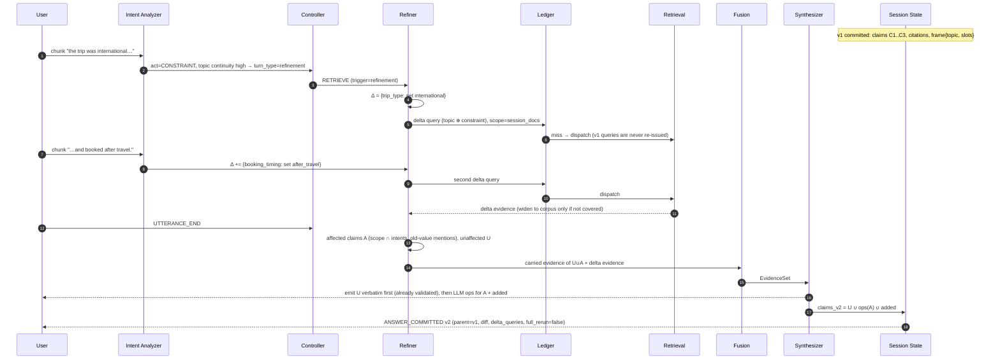
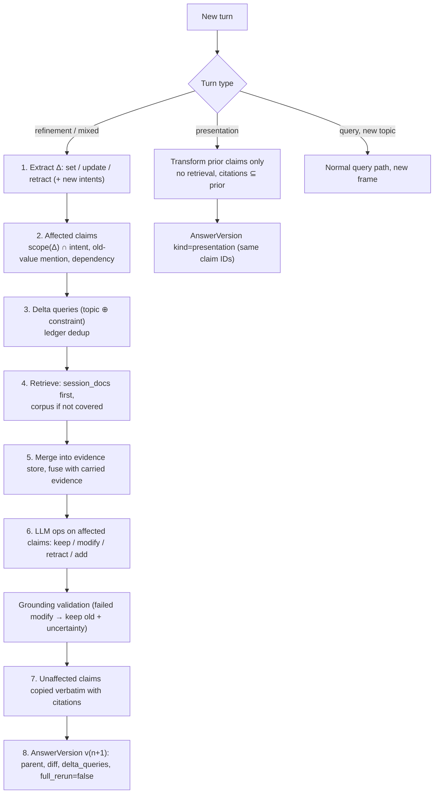
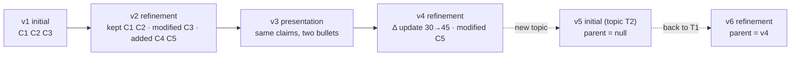

# 05: Session Refinement

This is a design artifact (Phase 2). Normative: spec §13, §14, §15, §17.

## Late detail: v1 → v2 without restart (guide Example 2, abstracted)

## Refinement algorithm (flow)

## Version lineage example (abstract)

