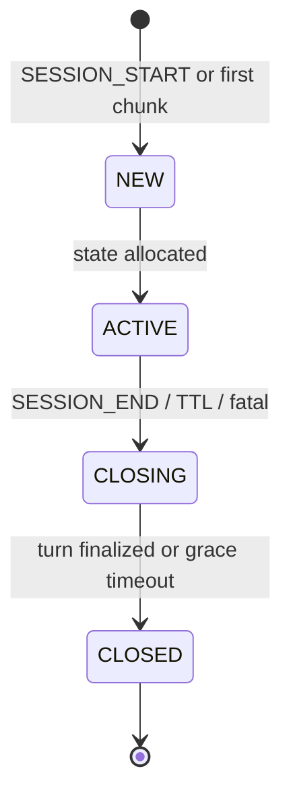
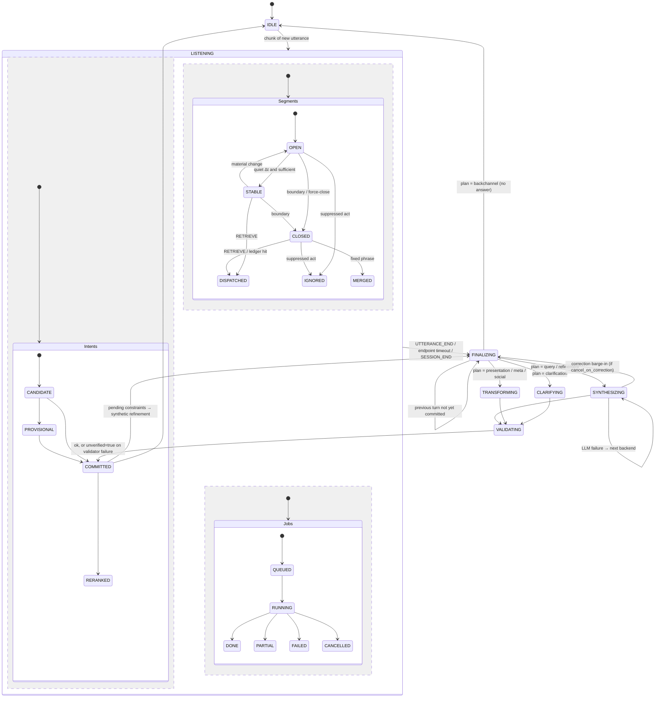

# 06: State Machine

This is a design artifact (Phase 2). Normative: spec §7 (tables, guards, failure behavior).

The machine is a hierarchical statechart:

| Level | Scope |
|---|---|
| L0 | Session |
| L1 | Turn |
| L2 | Concurrent regions inside `LISTENING` |

A flat state list cannot represent full duplex, where listening, retrieving and reranking happen at the same time (spec §7.1).

## L0: Session

## L1: Turn (with L2 concurrent regions inside LISTENING)

## Concurrency rule

A new utterance may enter `LISTENING` while the previous turn is `SYNTHESIZING` or `VALIDATING`, so early retrieval continues during the answer. Its `FINALIZING` waits for the previous `COMMITTED`. Commits are serialized, so the version lineage stays linear.

## Mapping of the brief's suggested states

| Suggested | Here |
|---|---|
| PARTIAL_UTTERANCE | Segment `OPEN` |
| WAITING_FOR_STABILITY | Segment `OPEN`, sufficient but not `STABLE` (WAIT `awaiting_stability`) |
| EARLY_RETRIEVAL | Intent `PROVISIONAL` + Job `RUNNING` during `LISTENING` |
| DECOMPOSING | Intent-region transitions + gated LLM check in `FINALIZING` |
| RETRIEVING | Job `RUNNING` |
| FUSING | Inside `FINALIZING` |
| ANSWERING | `SYNTHESIZING` (validated deltas streamed) |
| WAITING_FOR_LATE_DETAIL | `IDLE` with an open topic frame |
| REFINING | A plan mode through `FINALIZING → SYNTHESIZING` |
| ERROR | `ERROR` events with explicit degradation transitions (spec §23), not a state |
