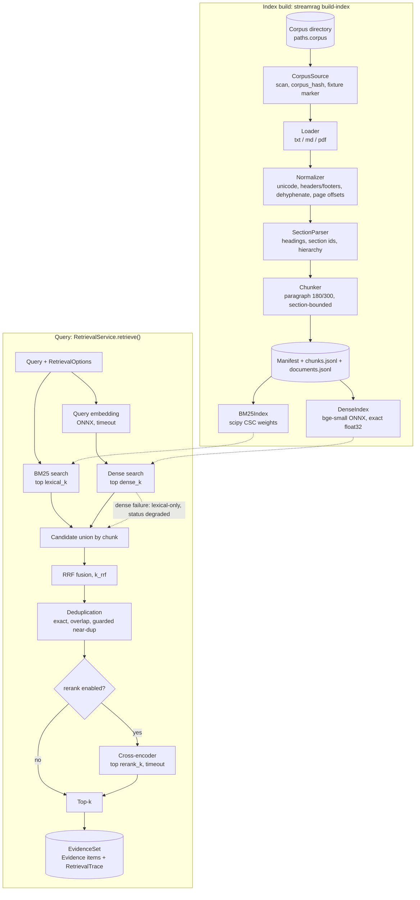

# 07: Retrieval Foundation (as implemented in Phase 3)

This diagram matches `src/streamrag/corpus` and `src/streamrag/retrieval` exactly. Module names are shown in each node.

## Notes

- **BM25-only or dense-only modes** skip the other branch. The fused list is then that single ranked list, and evidence is labeled `bm25` or `dense`.
- **Isolation:** the query path reads only the loaded index. There is no network import in `corpus/` or `retrieval/` (tested), and no document-injection API.
- **Integrity:** loading an index verifies the version, every artifact's sha256, chunk counts and embedding dimensions before any query runs.
