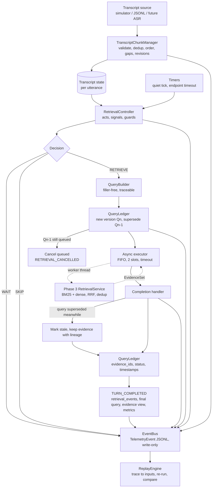
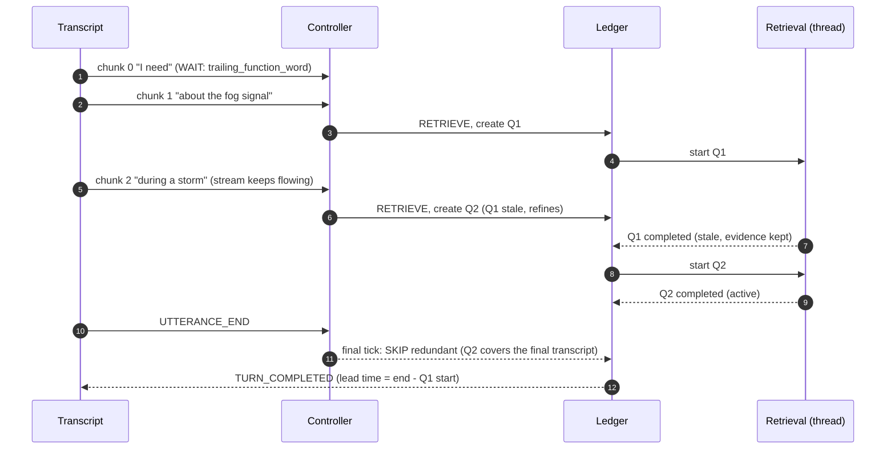

# 08: Streaming Engine (as implemented in Phase 4)

This diagram matches `src/streamrag/{streaming,controller,ledger,replay}`. Phase 3 retrieval is reused unchanged.

## Asynchronous flow

## Scope boundaries (Phase 4)

- **Single active query** per utterance. No multi-intent decomposition (Phase 5).
- **Output ends at `EvidenceSet`** plus `TURN_COMPLETED(answer = null)`. No answer generation, grounding validator or refinement (Phases 6–7).
- **No UI.** The CLI `streamrag stream` prints a debug stream.
