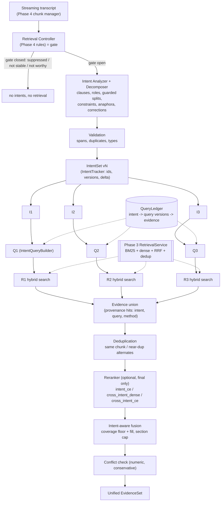
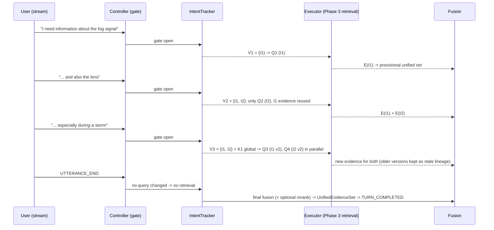
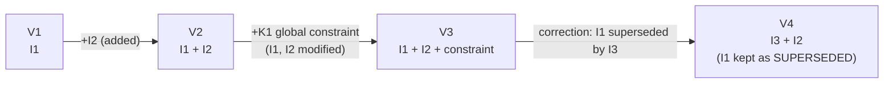

# 09: Multi-Intent RAG (as implemented in Phase 5)

The diagrams match `src/streamrag/{intents,multi_retrieval,fusion}` and the Phase 4 session they plug into. Phase 3 retrieval is reused unchanged; Phase 5 ends at the `UnifiedEvidenceSet` (no answer generation).

## Pipeline

Notes:
- **Retrieval:** R1–R3 are the same Phase 3 service, dispatched in parallel through the Phase 4 executor (`max_concurrent_retrievals` = 3).
- **Rerank order:** the reranker runs before selection so that cross-intent relevance can move a chunk into another intent's list. With `rerank: none` the node is a pass-through.

## Incremental intent addition (delta retrieval)

## Versions

