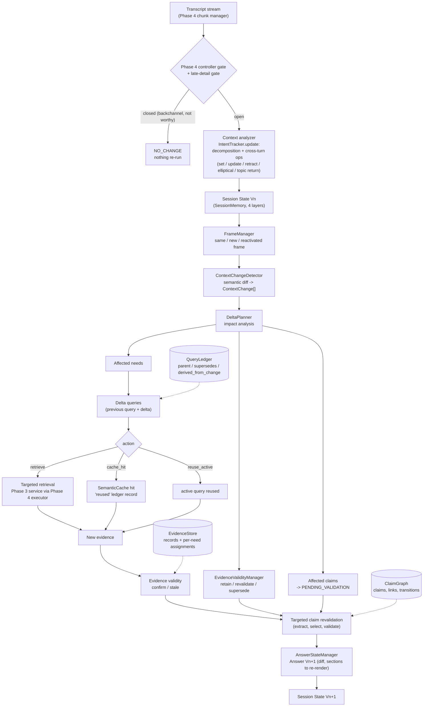
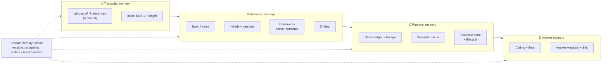
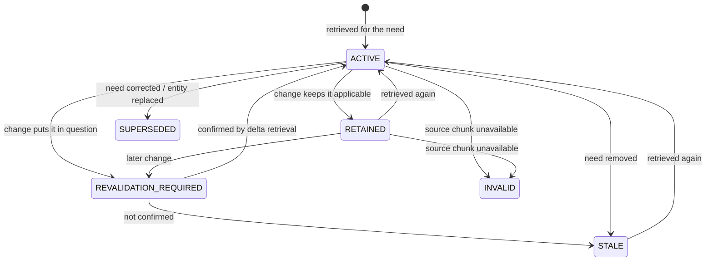
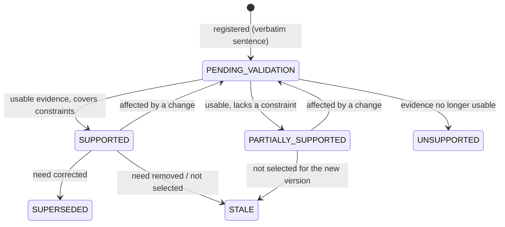
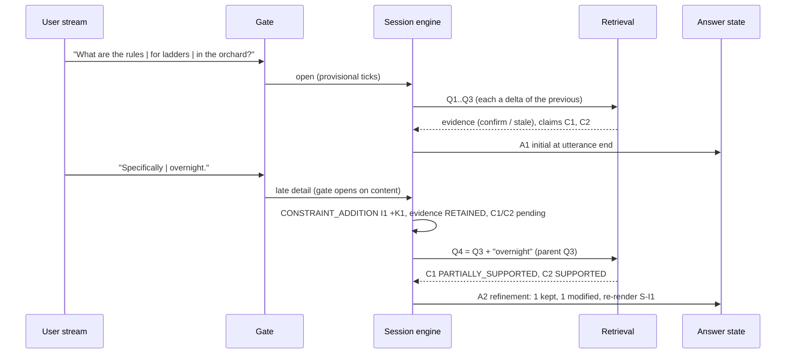

# 10: Adaptive Streaming RAG (as implemented in Phase 6)

The diagrams match `src/streamrag/{session,context,delta,claims,answers}` and their integration into the Phase 5 `MultiIntentCoordinator` (`session.enabled: true`). Phases 3–5 are reused unchanged. Phase 6 ends at a versioned, claim-level **answer state**; rendering text is Phase 7.

## Primary flow

## Memory layers

## Evidence lifecycle

## Claim lifecycle

## Streaming sequence (dev S01, from the generated trace)

## Integration points (unchanged components)

| Component | Phase 6 use |
|---|---|
| Phase 4 controller | still the gate. The late-detail gate opens it only for active-need refinements with content (`context/cues.py`) |
| Phase 4 executor / schedulers | same jobs. Virtual traces replay exactly, including all session events |
| Phase 5 decomposer / tracker | extended with cross-turn ops, the constraint registry, elliptical classification by corpus co-occurrence, topic return |
| Phase 5 per-intent guards | budgets now per (need, utterance). A guarded action is **deferred** and re-dispatched while its need version is current |
| Phase 5 fusion | runs on the turn's needs: own needs plus earlier needs the turn changed |
| Phase 3 retrieval | unchanged; delta queries are ordinary requests |

## Baseline for comparison

`FullRestartPipeline` (brief §41). On every turn it builds a fresh session over the whole conversation:
- full intent analysis of every turn;
- full query generation and retrieval of every active need of the current frame;
- no cache and no evidence retention;
- every claim re-extracted and re-validated;
- an `initial` answer every time.

It uses the same gate. Final queries were checked equal to the incremental pipeline's on a 6-turn session (test).
