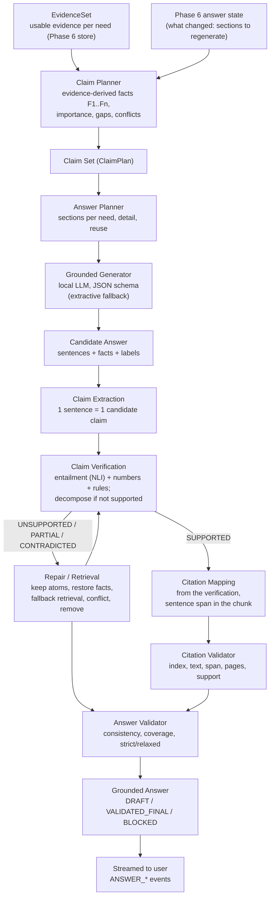
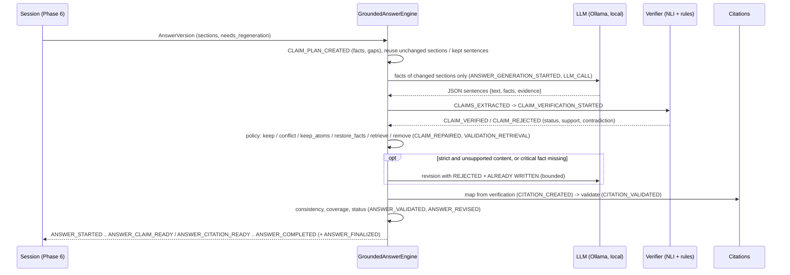
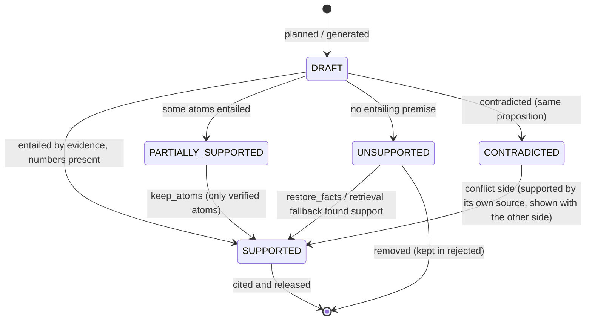
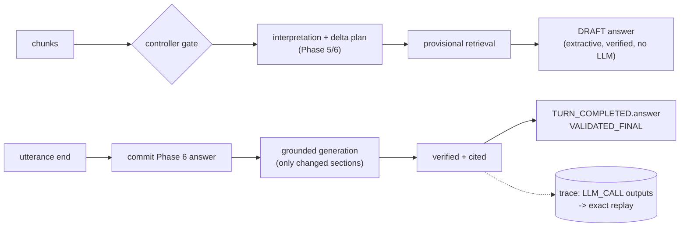

# 11: Grounded Answer Generation (as implemented in Phase 7)

The diagrams match `src/streamrag/{claims,generation,citations,validation,answer_state}` and their integration into
the Phase 6 session (sync pipelines and the streaming coordinator, `generation.enabled: true`). The generator is not
the source of truth: the evidence store is.

## Required architecture (brief §58)

## Per answer version (engine stages and events)

## Claim lifecycle in the answer

## Streaming integration

| Component | Phase 7 use |
|---|---|
| Phase 6 answer state | decides which sections changed; Phase 7 renders and validates only those |
| Phase 6 evidence store | the verification pool per need and the citation source; fallback retrieval adds to it |
| Phase 3 retrieval / index | fallback retrieval; the index is the authority for every citation location |
| Phase 4 replay | LLM outputs recorded in `LLM_CALL` and replayed by request hash |
