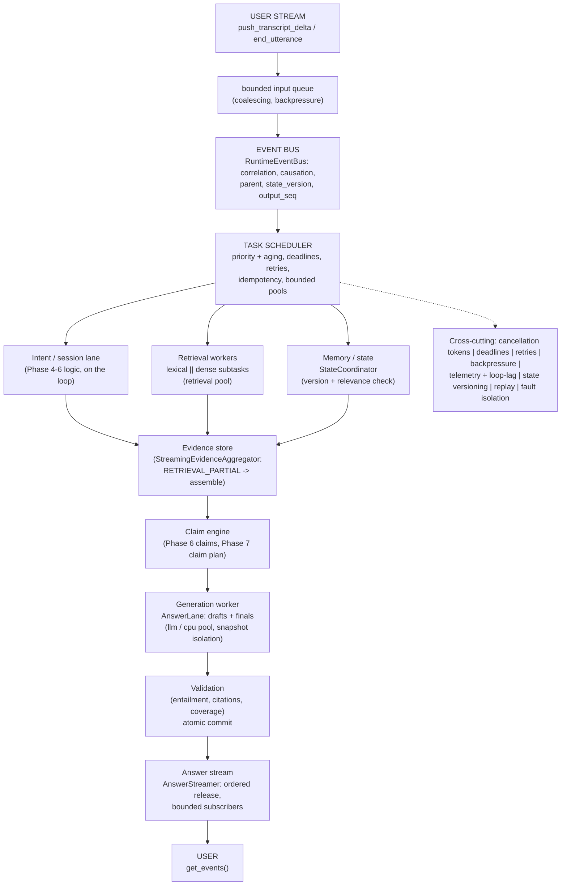
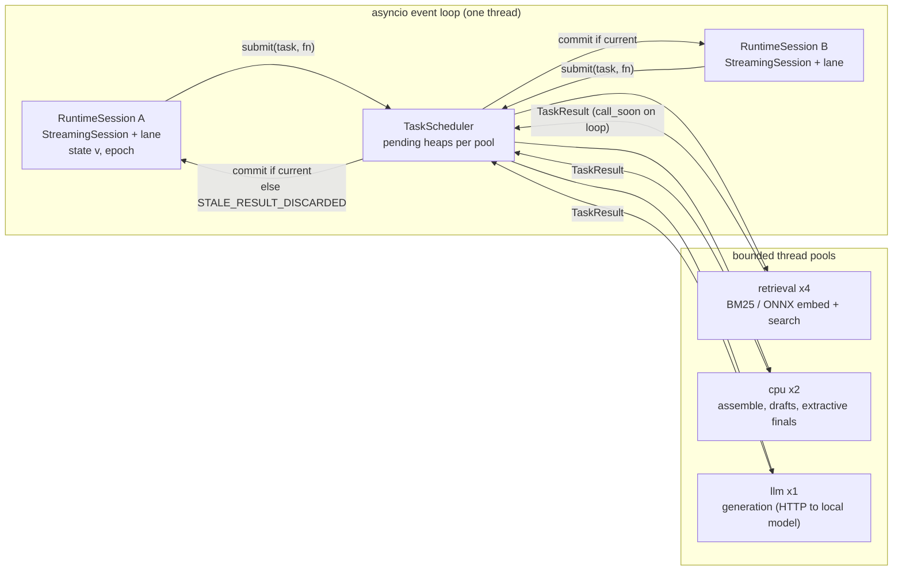
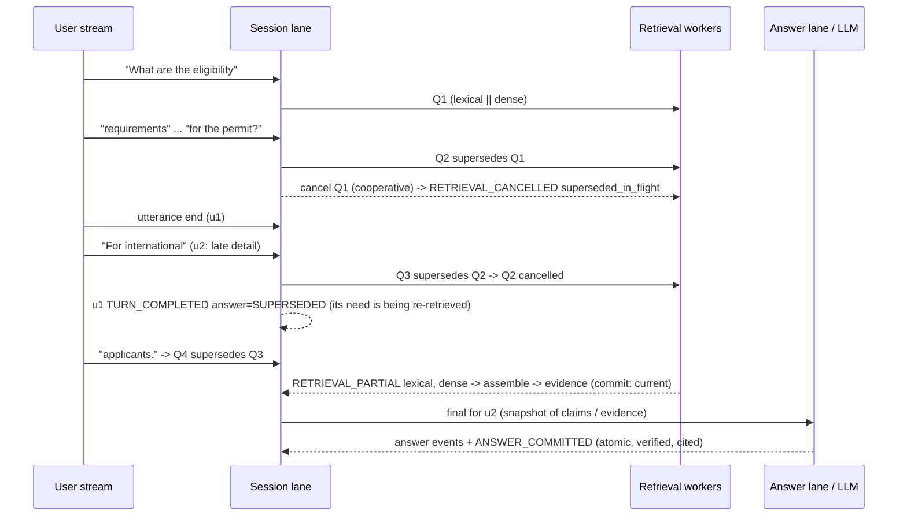

# 12: Streaming Runtime (as implemented in Phase 8)

The diagrams match `src/streamrag/runtime/` and its integration with the Phase 4–7 session (`StreamingSession`, `MultiIntentCoordinator`, `GroundedAnswerEngine`). Details: `docs/runtime/01–12`, ADR-018.

## Required architecture (brief §78)

## One session actor, shared bounded workers

## A turn with a late detail (end-to-end demo, research/phase8/results/e2e_demo)

## Task state machine

```mermaid
stateDiagram-v2
  [*] --> PENDING: submit (bounded queue; else rejected / shed)
  PENDING --> RUNNING: slot free, best priority-aging
  PENDING --> CANCELLED: superseded / reset / shed
  PENDING --> TIMED_OUT: deadline passed before start
  RUNNING --> COMPLETED
  RUNNING --> FAILED: deterministic error / retries exhausted
  RUNNING --> PENDING: transient error -> backoff retry
  RUNNING --> CANCELLED: token cancelled, worker reached a checkpoint
  RUNNING --> TIMED_OUT: deadline (slot held until the worker returns)
  COMPLETED --> [*]: StateCoordinator: applied, or STALE_RESULT_DISCARDED
```

| Phase 4–7 component | Phase 8 change |
|---|---|
| `StreamingSession` (Phase 4) | unchanged logic; batched chunks (one decision per batch), busy hooks, cooperative cancellation hook |
| `VirtualScheduler` / `RealtimeScheduler` | reused as the runtime clock; `SessionClock` adds causal dispatch and epoch guards |
| executors (Phase 4) | replaced in the runtime by `RuntimeRetrievalExecutor` (same interface) on the `TaskScheduler` |
| `RetrievalService` (Phase 3) | split into `plan` / `search_lexical` / `search_dense` / `assemble`; `retrieve()` composes them (identical results) |
| coordinator (Phase 5/6) | `_supersede` helper (cooperative cancellation), answer hand-off to the lane |
| `GroundedAnswerEngine` (Phase 7) | checkpoint / restore, cancellation checkpoints, call context for the LLM |
| `ReplayEngine` (Phase 4) | runtime traces replayed by `replay_runtime` (virtual clock, recorded LLM outputs) |
