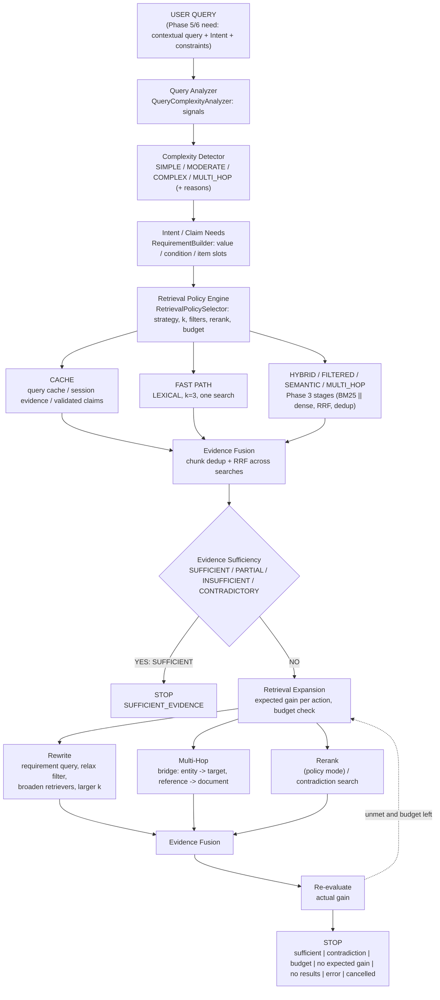
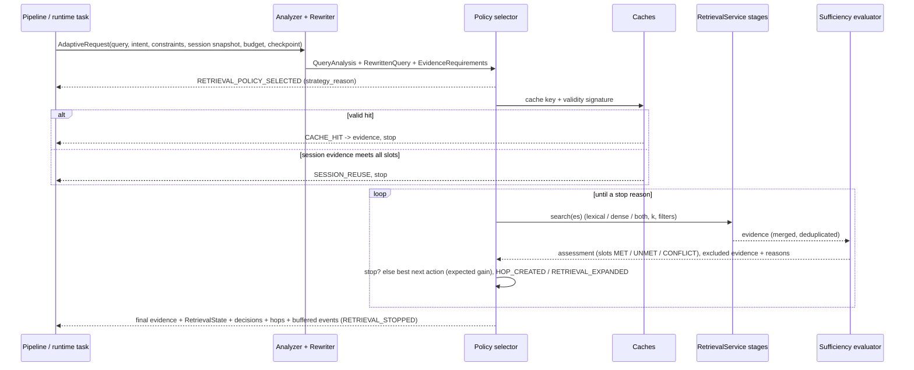
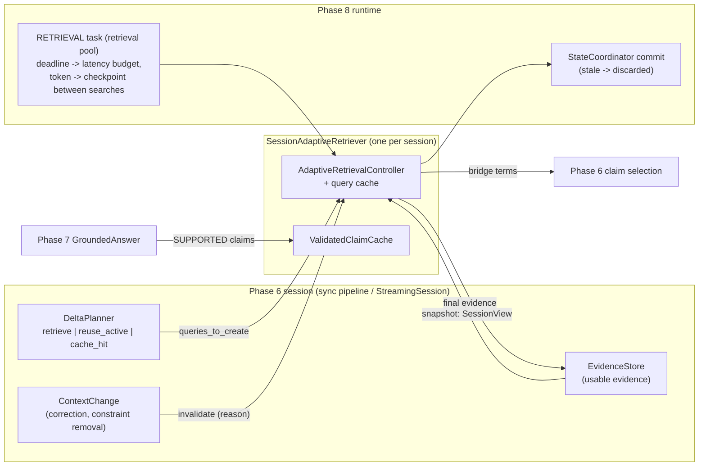

# 13: Adaptive Retrieval (as implemented in Phase 9)

Code: `src/streamrag/adaptive/` (analyzer, rewrite, catalog, requirements, sufficiency, policy, stopping, cache,
controller, integration). Details: `docs/retrieval/01_query_analysis.md` … `11_budget_management.md`, ADR-019.
Off by default (`adaptive_retrieval.enabled`); measurements: `research/phase9/results/` (fixture, NOT REPORTABLE).

## Required architecture (brief §70)

## Inside one need (controller)

## Integration

| Earlier component | Phase 9 change |
|---|---|
| `RetrievalFilters` / `RetrievalService` (Phase 3) | metadata filters (whitelisted fields) and validity window (`valid_at`, `valid_to`); evidence carries document metadata |
| corpus pipeline | sanitised whitelisted front-matter metadata (`corpus/metadata.py`) |
| `AdaptivePipeline` (Phase 6) | `_execute_adaptive`: one controller run per need; Phase 6 change -> cache invalidation; Phase 7 claims -> claim cache |
| `AdaptiveSessionEngine` (Phase 6) | `retrieval_terms`: hop targets extend claim selection |
| `RuntimeRetrievalExecutor` (Phase 8) | `_submit_adaptive`: one RETRIEVAL task per need (instead of lexical / dense / assemble subtasks) |
| `claims/textcheck.py` (Phase 7) | time values include clock times ("9:00") and weekday / weekend / holiday words |
| event vocabulary | RETRIEVAL_POLICY_SELECTED, QUERY_REWRITTEN, EVIDENCE_ASSESSED, RETRIEVAL_EXPANDED, RETRIEVAL_STOPPED, CACHE_HIT, CACHE_MISS, RETRIEVAL_INVALIDATED, HOP_CREATED (+ per-search RETRIEVAL_STARTED / COMPLETED with `adaptive_search`) |
