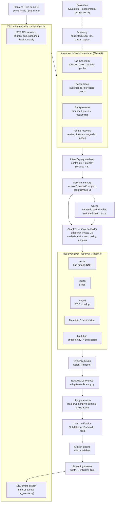
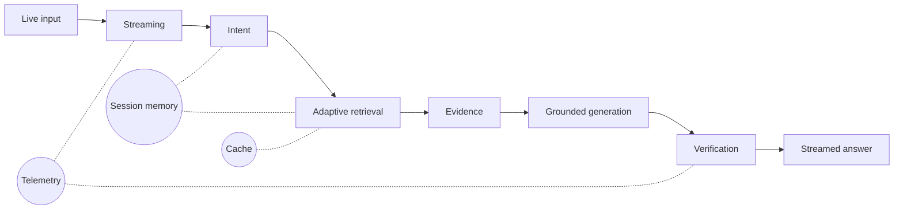

# 14. Final Architecture (Phase 11, frozen)

The final pipeline is frozen as `configs/default.yaml` plus `configs/profiles/final.yaml`. That combination is used by
`streamrag serve`, the Docker image and the final benchmark. Every box below names the module that implements it.
Nothing here is planned-only.

## 14.1 The frozen pipeline

```
USER / LIVE INPUT          transcript chunks (ASR or typed), revisions, utterance end    server/app.py, runtime/runtime.py
      ↓
STREAM INGESTION           bounded input queue, ordering, coalescing, backpressure        runtime/backpressure.py, streaming/
      ↓
QUERY / INTENT ANALYSIS    retrieve / wait / skip decision; multi-intent decomposition   controller/, intents/
      ↓
SESSION STATE              needs, frames, context changes (refine / correct / extend)    session/, context/, ledger/
      ↓
CLAIM REQUIREMENTS         what each need must establish (claim slots)                    adaptive/requirements.py
      ↓
ADAPTIVE RETRIEVAL         per-need plan: fast path ... filtered ... iterative / multi-hop adaptive/ (policy, router, controller)
      ↓
EVIDENCE FUSION            intent-aware fusion, dedup, cross-intent sharing               fusion/
      ↓
EVIDENCE VALIDATION        lifecycle per need: active / retained / stale; delta retrieval delta/, session/engine.py
      ↓
GROUNDED GENERATION        claim plan -> local LLM (structured) or extractive generator   generation/, answer_state/engine.py
      ↓
CLAIM VERIFICATION         entailment (NLI) + rules per claim; repair or removal          claims/verifier.py, validation/
      ↓
CITATION VALIDATION        claim -> supporting section; invalid citations dropped         citations/
      ↓
STREAMING RESPONSE         drafts while the user speaks, validated final answer           runtime/answers.py, runtime/streamer.py
      ↓
SESSION UPDATE             versioned answer state, claim cache, evidence reuse            answers/, answer_state/, adaptive/cache.py
```

## 14.2 System architecture



**Cross-cutting components**

| component | where | what it guarantees |
|---|---|---|
| cache | `session/` semantic cache, `adaptive/cache.py` | reuse only when the validity signature matches (index hash, filters, intent version) |
| telemetry | `runtime/events.py`, `telemetry/` | every event carries `session_id`, `utterance_id`, `correlation_id`, `causation_id`, `parent_event_id`, `state_version`; traces replay deterministically (`streamrag replay`) |
| evaluation | `src/streamrag/evaluation/`, `experiments/` | every number in the reports comes from stored runs and traces |
| failure recovery | `runtime/retry.py`, `runtime/timeouts.py`, `runtime/answers.py` | retries with idempotency, deadline propagation, degraded modes (lexical-only, extractive, rules-only) |
| cancellation | `runtime/cancellation.py` | superseded or corrected work is cancelled cooperatively; stale results are discarded by version check |
| backpressure | `runtime/backpressure.py`, `runtime/streamer.py` | bounded input queues and subscribers; drafts are dropped before finals |

## 14.3 Presentation version (one slide)



## 14.4 What changed in Phase 11

These are bug fixes, found in the Phase 10 error analysis and the demo. Each has a regression test.

| change | module | test |
|---|---|---|
| an LLM timeout falls back to an extractive answer (the redo gets its own deadline) | `runtime/answers.py` | `tests/timeouts/test_deadlines.py::test_extractive_fallback_survives_an_exhausted_turn_budget` |
| "which documents do X need" is a question, not meta-conversation | `controller/acts.py` | `tests/controller/test_controller_decisions.py::test_meta_phrase_about_corpus_content_is_a_request` |
| evidence that only superseded partial-transcript queries retrieved is dropped when the refined query returns | `session/engine.py` | `tests/streaming_integration/...::test_final_query_drops_evidence_only_partial_transcripts_retrieved` |
| a need is re-validated against its latest query when the per-need query budget is used up | `multi_retrieval/coordinator.py` | `tests/streaming_integration/...::test_need_keeps_its_evidence_when_the_query_budget_is_exhausted` |
| the claim decomposer no longer garbles "A and B of C" lists | `claims/decomposer.py` | `tests/claims/...::test_decomposition_never_garbles_noun_complements_or_verb_phrases` |
| documents scoped to different groups are not reported as conflicting; version conflicts are labelled current / superseded | `answer_state/engine.py`, `answer_state/render.py` | `tests/answer_state/...::test_version_conflict_is_labelled_current_and_superseded` |
| LLM answerability flag (switch, **off** by default after the development check) | `generation/`, `answer_state/engine.py` | `tests/answer_state/...::test_section_the_model_judges_unanswered_*` |
| deployment: HTTP API, UI, `/health`, `/ready`, Docker, environment settings, LLM host allowlist | `server/`, `config/settings.py`, `Dockerfile` | `tests/server/`, `tests/test_config.py` |
