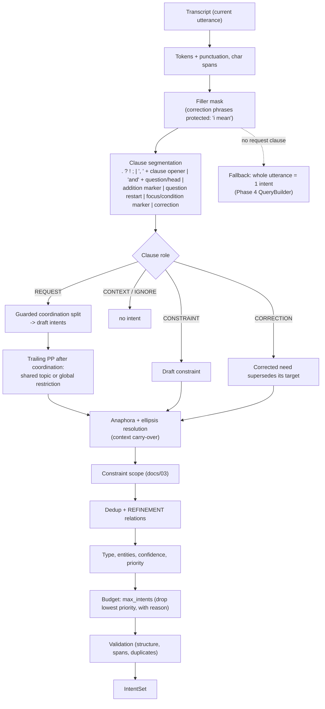

# 02: Intent Decomposition

**Code:** `intents/decomposer.py`, `intents/lexicon.py`, `intents/text.py`, `intents/validation.py`, `intents/llm_check.py`
**Config:** `multi_intent:` in `configs/default.yaml`, `configs/intent_lexicon.yaml` (generic English), `configs/controller_lexicon.yaml` (shared)
**Spec:** Phase 2 §9.3–9.6

## Pipeline (rule-first, deterministic)

## Clause roles

| Role | Rule (first match wins) |
|---|---|
| `CORRECTION` | Starts with a strong correction phrase ("i meant", "no wait", "scratch that", …). A replacement ("instead of", "rather than") after a request also counts. |
| `CONSTRAINT` | Starts with a focus marker (especially, specifically, in particular …), a condition marker (if, unless, in case …), an explicit scope phrase ("for both of them"), or a restriction preposition with no request cue (", for visitors") |
| `REQUEST` | Starts with a request head ("tell me", "i need information", "what about"), a question word, an auxiliary inversion ("are there …"), or an imperative request verb. Also: an addition marker after an earlier request ("… and also the lens"), or a facet noun phrase without a first-person subject ("the requirements for ladders, how long …"). |
| `IGNORE` | Only social, backchannel or stop words |
| `CONTEXT` | Anything else (narrative: "yesterday I walked past the orchard and the tool shed …") |

Only `REQUEST` clauses produce intents. This is the main over-decomposition guard: nouns in narrative clauses never become needs.

## Coordination split (under one request head)

A request body splits at `and`, `plus`, `&` and list commas. Each split is guarded, and conjuncts are merged back when any of these holds:
- **No substantive content:** the conjunct has only generic nouns ("information and details about X"), function words or bare numbers.
- **Fixed phrase:** `(last word of A, first word of B)` occurs as "a and b" **in the indexed corpus** ("third and fifth week"). The table is built from the loaded index, so nothing is hardcoded.
- **Pair or comparison:** the body is a comparison ("difference between …", "versus") or a pair/range ("between X and Y").

`or` never splits: "ladders or crates" is one choice.

**ASR lists without commas.** Inside a coordinated body, an article directly after a content word starts a new item ("the planting schedule | the water each sapling gets | and the approved varieties"). The exception is an item containing an auxiliary verb, which is a relative clause ("the time | the lamp is cleaned").

**Question restart without punctuation:**
- "how" starts a new clause unless an embedding verb, preposition, coordinator or marker precedes it ("I want to know how …").
- "what / when / where / why" start a new clause only when an auxiliary follows.

## Shared context in coordinations

`A and B <PP>`, where neither A nor B has a preposition of its own:

| Earlier conjuncts | Result |
|---|---|
| Facet-only ("the rules and the schedule **for pruning**") | The PP is a **shared topic**: inherited by A (`reason=distributed_pp`) |
| Have their own topic ("the dome and the telescope **for visitors from abroad**") | The PP is a **global restriction** on both |

## Anaphora and ellipsis (context carry-over)

- **Pronouns** (it, they, them, those …; this/that only when not followed by a noun) are replaced by the topic of the nearest earlier intent in the utterance. Failing that, they take the topic of the most recent intent of the previous utterance. The relation is `DEPENDENT` within an utterance and `FOLLOW_UP` across utterances.
- **Locative anaphora** ("there") is never guessed: it goes to `unresolved_references`.
- **Antecedent inside the need:** a pronoun is not replaced when the need itself already has a content word before it ("what do workers do before **they** leave").
- **Ellipsis:** a need made only of facet nouns ("and what about the application process?") inherits the previous need's topic.
- **No blind copying:** a need that names its own topic does not inherit ("and what about the lens?").

## Corrections

The corrected need supersedes its target:
- the need containing the replaced words ("instead of X"), else the most recent need;
- searched in this utterance first, then earlier ones.

If the correction names only a new topic ("I meant crates instead of ladders"), it is rebuilt from the target's words with the replaced words substituted: "the requirements for crates". Every piece keeps its source span. The old intent becomes `SUPERSEDED`, keeping its provenance.

## Dedup and refinement

| Condition | Result |
|---|---|
| Content-term Jaccard = 1 (or ≥ `duplicate_jaccard` 0.8) | Merge (`merged[]`, reason `duplicate` / `near_duplicate`) |
| A's own terms ⊂ B's own terms | `REFINEMENT` (B refines A). Example: "the tool shed" + "the tool shed's register process". |

## Relationships implemented

| Type | When | Used by |
|---|---|---|
| `DEPENDENT` | Pronoun or ellipsis resolved to an earlier need in the same utterance | Query context; later answer ordering |
| `FOLLOW_UP` | Resolved to a need of an earlier utterance | Same |
| `REFINEMENT` | Narrower need on the same terms | Fusion (shared evidence expected); answer organisation |
| `CONSTRAINT_OF` | Represented by `Constraint.applies_to` | Delta retrieval |
| `COMPARISON_WITH` | In the vocabulary but not produced: a comparison stays one intent | — |

`INDEPENDENT` is the default (absence of an edge).

## Validation (deterministic, before any retrieval)

`validate_intent_set` checks:
- empty output for a non-empty utterance;
- duplicate intent or constraint ids;
- duplicate intents (same analyzed terms);
- unsupported types;
- dangling constraint scopes and relationships;
- source spans that do not match the transcript.

`validate_queries` flags empty or identical queries. Rule output passing validation is a tested invariant.

## Optional LLM check (`multi_intent.llm_check: gated`, default `off`)

- **Gating:** at most one call per utterance, at the utterance end, and only when gated:
  - G-a: ≥ 2 request cues but 1 intent;
  - G-b: long utterance;
  - G-c: ambiguous constraint scope;
  - G-d: decomposition confidence < 0.6.
- **Output handling:**
  1. The output must be strict JSON (`LLMDecomposition` schema).
  2. Malformed output → retry once → fall back to the rule result.
  3. Each proposed need must quote a **verbatim** `source_text` from the transcript. Ungrounded needs and unsupported types are rejected individually.
- **Reconciliation:**
  - A matched need (term Jaccard ≥ 0.5) marks the rule intent `reconciled`.
  - An unmatched grounded need is added with provenance `llm`.
  - Rule intents are never removed by the LLM.
- **Status:** no LLM backend is configured (ADR-007, decision Q2 open). This path is exercised only with scripted fake backends in tests and has **not** been measured with a model.
