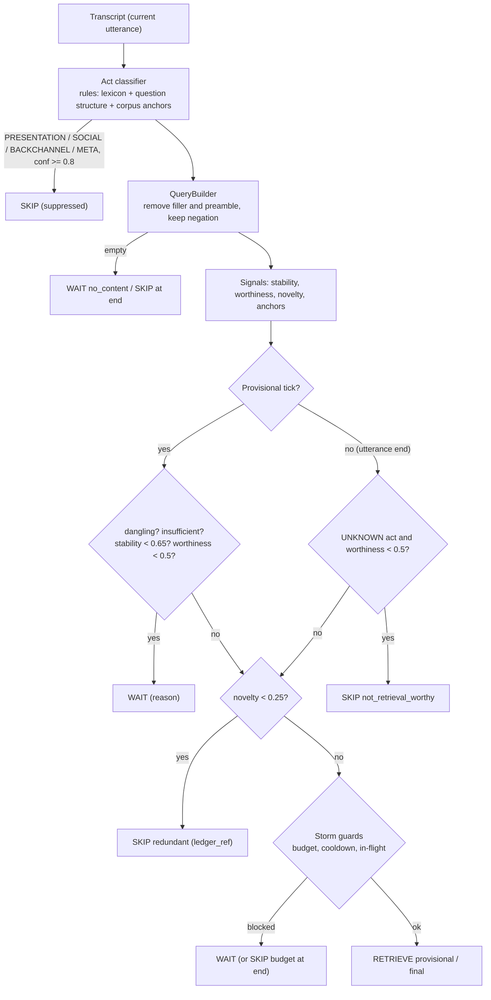

# 03: Retrieval Controller

**Code:** `controller/` (acts, signals, query_builder, controller, lexicon)
**Config:** `controller:` in `configs/default.yaml`, `configs/controller_lexicon.yaml`
**ADRs:** ADR-004, ADR-014

## Purpose

On every transcript change, every quiet period and the end of the utterance, decide **WAIT**, **RETRIEVE** or **SKIP**. Retrieval should start as early as is *useful*, without storms, without noisy fragments, and never on turns that need no retrieval.

## Decision pipeline

## Signals (exact formulas; `controller/signals.py`)

| Signal | Definition |
|---|---|
| `anchor_strength` | max IDF of the query's terms that exist in the **corpus vocabulary**, divided by the IDF of a term found in exactly one chunk (capped at 1). Corpus statistics, not keywords. |
| `semantic_stability` | `0.35·complete + 0.20·min(1, content/3) + 0.20·has_anchor + 0.15·request_form + 0.10·persistence`. `complete` = 0 if the transcript ends in a dangling function word or comma. `persistence` = term-Jaccard with the previous decision's query, or 1 on a quiet tick, a sentence boundary or the utterance end. |
| `retrieval_worthiness` | `base(act) + 0.25·anchor_strength + 0.10·min(anchors,3)/3 + 0.10·explicit_question`, with base `INFO_REQUEST = 0.55`, `UNKNOWN = 0.20`, suppressed acts `= 0` |
| `novelty` | `1 − max term-Jaccard(query, any earlier session query)` |
| Sufficiency (provisional) | ≥ 1 anchor, and either ≥ 2 content terms or `anchor_strength ≥ 0.8` |

## Act classifier (`acts.py`)

`RuleActClassifier` is the default. It checks, in order:

1. Backchannel-only.
2. "More information" requests (these always need retrieval).
3. Meta questions.
4. **Presentation.** A transformation verb whose residual words are only objects, format words or languages ("make that shorter", "summarize the retrieved evidence"). If the residual contains a corpus anchor ("summarize the X rule"), it is an INFO_REQUEST instead.
5. Question or request form.
6. Social marker with no corpus anchor.
7. Otherwise UNKNOWN.

`PrototypeActClassifier` is the model-based alternative: nearest centroid of embedded generic seed phrases. It is used for the rules-vs-model ablation.

## Decisions and reason codes

| Decision | Reasons |
|---|---|
| WAIT | `no_content`, `trailing_function_word`, `low_specificity`, `awaiting_stability`, `not_yet_retrieval_worthy`, `cooldown`, `provisional_budget_exhausted`, `retrieval_in_flight` |
| RETRIEVE | `stable_retrieval_worthy_request` (provisional), `utterance_end_final_query` (final) |
| SKIP | `presentation_restructure`, `social_ack`, `backchannel`, `meta_conversation` (suppressed); `not_retrieval_worthy`, `empty_content` (not_worthy); `redundant_query` (redundant); `budget_exhausted` (budget) |

**Mapping to Phase 2:** `SKIP(suppressed | not_worthy)` = Phase 2 `NO_RETRIEVE`; `SKIP(redundant)` = Phase 2 `RETRIEVAL_SKIPPED(ledger_hit)`. Information requests are never suppressed. If they lack anchors they wait, but they are always retrieved at the utterance end (Phase 2 correction K4).

**Confidence** (derived, never hand-set):

| Decision | Confidence |
|---|---|
| RETRIEVE | `0.4·stability + 0.4·worthiness + 0.2·novelty` |
| WAIT | `1 − stability` (or 1.0 for a guard) |
| SKIP (suppressed) | Act confidence |
| SKIP (redundant) | `1 − novelty` |
| SKIP (not worthy) | `1 − worthiness` |

## How it prevents the failure modes

| Failure | Mechanism |
|---|---|
| Retrieval storm | Fires on content change, not on transport; cooldown (400 ms); per-utterance budget of 4 with one slot reserved for the final query; novelty check |
| Noisy fragments | Dangling detection; sufficiency (anchors); stability threshold |
| Duplicate retrieval | Novelty against the ledger (session-wide) |
| Latency | Rules only. Measured decision cost is in the Phase 4 report §16. |
| Unnecessary LLM calls | There is no LLM in the controller |

## Configuration (initial values from Phase 2 reasoning; not tuned on evaluation data)

`min_content_tokens: 2`, `anchor_idf_floor: 1.0`, `strong_anchor_strength: 0.8`, `min_stability: 0.65`, `min_worthiness: 0.5`, `act_suppress_confidence: 0.8`, `stability_quiet_ms: 600`, `novelty_threshold: 0.25`, `retrieval_cooldown_ms: 400`, `max_retrievals_per_utterance: 4`, `reserve_final_retrieval: true`, `allow_parallel_retrieval: true`, `max_concurrent_retrievals: 2`, `cancel_superseded: queued_only`, `endpoint_timeout_ms: 3000`.

## Ablation policies

| Policy | Behavior |
|---|---|
| `strategy: end_only` (A) | Static RAG: retrieve once at the utterance end; no suppression |
| `strategy: every_chunk` (B) | Retrieve whenever the transcript changes; no guards |

## Trade-offs

- Lexicon rules are generic but English-only.
- On a tiny corpus, common words can become anchors (for example "night" or "high" in the fixture).
- Thresholds must be re-checked on the official corpus and labels.
