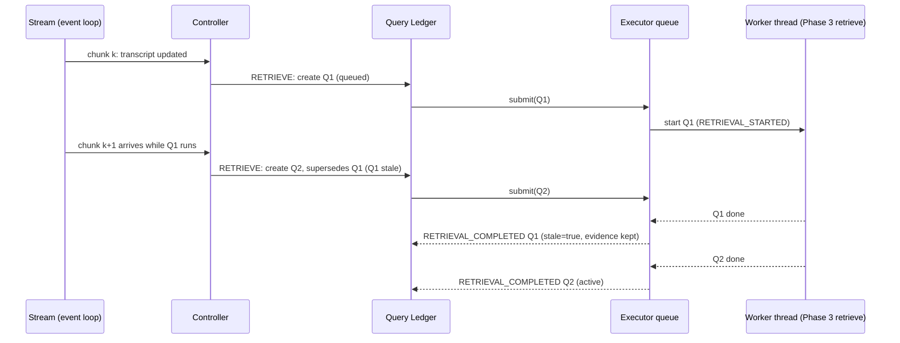

# 05: Asynchronous Retrieval

**Code:** `streaming/executor.py`, `streaming/runner.py`, `streaming/session.py`
**Tests:** `tests/streaming/test_async_realtime.py`

## Purpose

Run Phase 3 retrieval without freezing the transcript stream.

## Design

**Executors.** Both have a FIFO queue with `max_concurrent_retrievals` (2) running slots.

| Executor | Behavior |
|---|---|
| `AsyncExecutor` (realtime) | `await asyncio.wait_for(asyncio.to_thread(service.retrieve, …), retrieval_timeout_ms)`. Completion is delivered on the event loop, so all session state is mutated on one thread (no locks). |
| `VirtualExecutor` (deterministic) | Runs the retrieval at its start time (real evidence) and delivers completion at `start + sim_retrieval_latency_ms` on the virtual clock |

**Thread safety.** I verified Phase 3 `RetrievalService.retrieve` under 16 concurrent threads: results were identical to sequential calls.

**Timeout and failure.**
- A timeout produces `RETRIEVAL_COMPLETED(status=timeout)` plus `ERROR(RetrieverTimeoutError)`.
- A backend exception produces `RETRIEVAL_COMPLETED(status=error)` plus `ERROR(action=keep_previous_evidence)`.

The utterance still completes (`TURN_COMPLETED`).

## Avoiding unnecessary complexity

- There are no locks, because all state changes happen on the event loop.
- There is no process pool: retrieval costs milliseconds, and ONNX/numpy release the GIL.
- There is no cancellation of running threads. That is unsafe in Python, and unnecessary at this cost (doc 06).

## Measured behavior

Under a deliberately slow backend (400 ms per call) with chunks every 100 ms, chunks continued to be processed while retrieval was in flight. That is asserted in tests. Real latencies are in the Phase 4 report §16.
